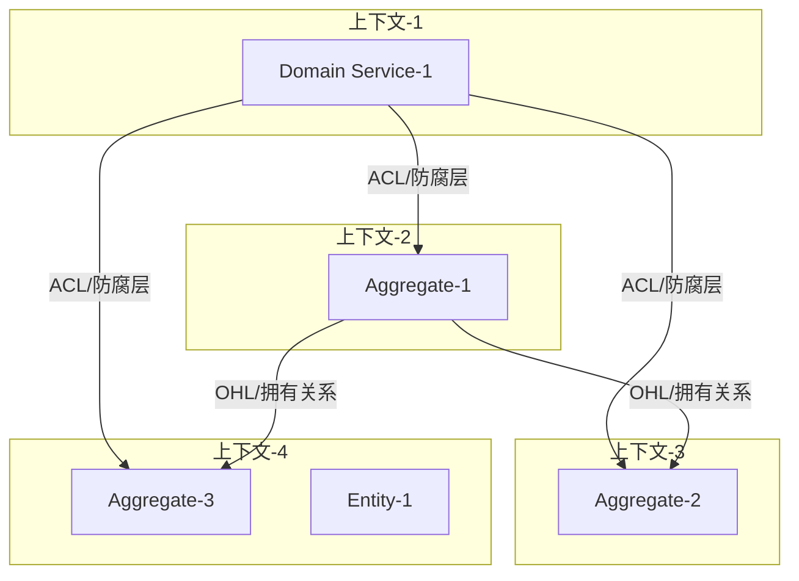
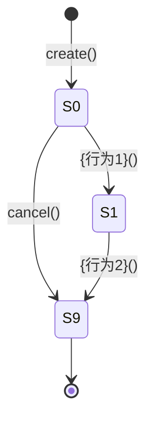

# {功能名称} - 领域设计文档

> **文档版本**：v1.0
> **创建时间**：{YYYY-MM-DD}

---

## 文档说明

本文档是领域架构师的核心产出物，整合了限界上下文、聚合、领域和应用层四个部分。

### 核心原则

- **理论依据**：所有设计都有明确的理论支撑（DDD、状态机理论、不变量理论）
- **最佳实践**：符合业内公认的设计模式和规范
- **可验证性**：每个约束都可写成 assert，每个用例都可转化为测试

### 适用范围

本文档适用于以下架构类型：
- [ ] DDD 分层架构 Starter -> Application → Domain → Infra
---

## 一：限界上下文设计

> **目标**：识别业务核心能力，划分限界上下文，定义上下文间关系。

### 1. 业务能力分析

#### 1.1 业务能力树

```
{业务领域}
├── {一级能力1}
│   ├── {二级能力1.1}
│   └── {二级能力1.2}
└── {一级能力2}
    ├── {二级能力2.1}
    └── {二级能力2.2}
```

#### 1.2 能力分级

| 能力 | 类型 | 说明 | 战略重要性 |
|------|------|------|-----------|
| {能力1} | 核心域 | 差异化竞争力 | 高 |
| {能力2} | 支撑域 | 必要但非差异化 | 中 |
| {能力3} | 通用域 | 可外包/复用 | 低 |

#### 1.3 能力与团队对齐

| 能力 | 负责团队 | 上下游关系 |
|------|---------|-----------|
| {能力1} | {团队A} | 上游：{能力X}，下游：{能力Y} |

---

### 2. 限界上下文划分

#### 2.1 上下文识别

| 上下文名称 | 负责的业务能力 | 核心实体           | 上下文类型 |
|----------|--------------|-------------------|----------|
| {上下文1} | {能力描述}    | {实体1}<br> {实体2} | 核心域    |
| {上下文2} | {能力描述}    | {实体3}<br> {实体4} | 支撑域    |


---

### 3. 上下文映射

#### 3.1 上下文关系图



#### 3.2 集成模式定义

| 上游 | 下游 | 关系类型 | 集成模式 | 说明 |
|------|------|---------|---------|------|
| {上下文A} | {上下文B} | 上游下游 | O/C（上游/下游） | A 的变化影响 B |
| {上下文B} | {上下文C} | 独立 | ACL（防腐层） | C 通过防腐层调用 B |

#### 3.3 防腐层设计

| 防腐层位置 | 目标上下文 | 转换逻辑 |
|-----------|-----------|---------|
| {位置} | {上下文C} | 将 C 的 DTO 转换为本域的领域模型 |

---

## 二：聚合设计

> **目标**：在限界上下文内进行聚合设计，定义领域模型结构。

### 1. 聚合总览

#### 1.1 聚合清单

| 聚合名称 | 聚合根 | 聚合边界 | 一致性保证 |
|---------|--------|---------|-----------|
| {聚合1} | {聚合根实体} | 包含的实体/值对象 | {不变量描述} |

#### 1.2 聚合间关系图

```
{聚合根}
├── {实体1}（实体）
│   └── {值对象1}（值对象）
└── {实体2}（实体）
```

#### 1.3 聚合间引用

| 聚合 | 引用方式 | 目标聚合 | 引用类型 |
|------|---------|---------|---------|
| {聚合A} | ID 引用 | {聚合B} | 直接引用 |
| {聚合C} | 领域事件 | {聚合D} | 事件驱动 |

---

### 2. {聚合名称} 聚合

> 聚合详细设计：每个聚合独立一个子章节，包含完整的结构、状态、行为设计。


#### 2.1 聚合结构

**聚合成员**：

| 成员名称 | 类型 | 说明 |
|---------|------|------|
| {聚合根} | 聚合根 | {说明} |
| {实体1} | 实体 | {说明} |
| {值对象1} | 值对象 | {说明} |

**结构图**：

```
{聚合根}
├── {实体1}（实体）
│   └── {值对象1}（值对象）
└── {值对象2}（值对象）
```

#### 2.2 聚合根：{聚合根名称}

**聚合根**：{聚合根名称}

**职责**：{简要描述聚合根的核心职责和生命周期管理范围}

**唯一标识**：{标识字段名称}（{生成方式/规则}）

**{格式/结构定义}**：{格式说明}（如：{格式示例}）

**核心属性**：

| 属性名 | 类型 | 说明 |
| ------ | ---- | ---- |
| {属性1} | {类型1} | {属性1说明} |
| {属性2} | {类型2} | {属性2说明} |
| {属性3} | {类型3} | {属性3说明} |

**状态定义**：

| 状态码 | 状态名称 | 含义 | 可转移状态 |
| ------ | -------- | ---- | ---------- |
| {S0} | {状态1} | {状态1含义} | {可转移状态列表} |
| {S1} | {状态2} | {状态2含义} | {可转移状态列表} |
| {S2} | {状态3} | {状态3含义} | {可转移状态列表} |

**核心行为**：

| 行为名称 | 参数 | 返回值 | 业务规则 |
| -------- | ---- | ------ | -------- |
| {行为1}() | {参数列表} | {返回类型} | {业务规则描述} |
| {行为2}() | {参数列表} | {返回类型} | {业务规则描述} |
| {行为3}() | {参数列表} | {返回类型} | {业务规则描述} |

**{聚合根名称} 状态转移图**：



**不变量**：

- **INV-{聚合根缩写}-01**：{不变量1描述}
- **INV-{聚合根缩写}-02**：{不变量2描述}
- **INV-{聚合根缩写}-03**：{不变量3描述}
- **INV-{聚合根缩写}-04**：{不变量4描述}

**{外部集成/扩展支持/行为策略/特殊算法/}**：

1. **{集成类型1}**：
    - {集成方式1}
    - {集成方式2}
2. **{集成类型2}**：
    - {集成方式1}
    - {集成方式2}

**行为列表**：

| 行为方法 | 业务含义 | 允许状态 | 前置条件 | 后置条件 | 校验的不变量 |
|---------|---------|---------|---------|---------|-------------|
| create(params) | 创建聚合 | 无 | {条件} | 状态=S0 | INV-01 |
| {行为1}(params) | {含义} | S0 | {条件} | 状态=S1 | INV-02 |
| cancel(reason) | 取消 | S0, S1 | {条件} | 状态=S9 | 无 |

#### 2.3 实体列表

| 实体名称 | 唯一标识 | 生命周期 | 状态 | 说明 |
|---------|---------|---------|------|------|
| {实体1} | {id字段} | {周期} | {状态} | {说明} |

##### 2.3.1 实体：{实体名称}

**唯一标识**：{标识字段名称}（{生成方式}）

**类型**：{实体类型说明}（如：实体/不可变实体）

**职责**：{简要描述实体的核心职责和业务作用}

**核心属性**：

| 属性名 | 类型 | 说明 |
| ------ | ---- | ---- |
| {属性1} | {类型1} | {属性1说明} |
| {属性2} | {类型2} | {属性2说明} |
| {属性3} | {类型3} | {属性3说明} |

**状态定义**：

| 状态码 | 状态名称 | 业务含义 | 是否终态 | 允许的行为 |
|-------|---------|---------|---------|-----------|
| S0 | {初始状态} | {含义} | 否 | {行为1}, {行为2} |
| S1 | {中间状态} | {含义} | 否 | {行为3} |
| S9 | {终态} | {含义} | 是 | 无（只读） |

**核心行为**：

| 行为名称 | 参数 | 返回值 | 业务规则 |
| -------- | ---- | ------ | -------- |
| {行为1}() | {参数列表} | {返回类型} | {业务规则描述} |
| {行为2}() | {参数列表} | {返回类型} | {业务规则描述} |

**不变量**：

- **INV-{实体缩写}-01**：{不变量1描述}
- **INV-{实体缩写}-02**：{不变量2描述}
- **INV-{实体缩写}-03**：{不变量3描述}

**状态转移图**：


**行为列表**：

| 行为方法 | 业务含义 | 允许状态 | 前置条件 | 后置条件 | 校验的不变量 |
|---------|---------|---------|---------|---------|-------------|
| create(params) | 创建聚合 | 无 | {条件} | 状态=S0 | INV-01 |
| {行为1}(params) | {含义} | S0 | {条件} | 状态=S1 | INV-02 |
| cancel(reason) | 取消 | S0, S1 | {条件} | 状态=S9 | 无 |


##### 2.3.2 实体：{实体名称2} 

（同上结构，每个实体重复此模板）


#### 2.4 值对象列表

| 值对象名称 | 所属 | 属性 | 不变量 |
|-----------|------|------|--------|
| {值对象1} | {聚合根/实体} | {属性列表} | {约束} |

##### 2.4.1 值对象：{值对象名称}

**职责**：{简要描述实体的核心职责和业务作用}

**核心属性**：

| 属性名 | 类型 | 说明 |
| ------ | ---- | ---- |
| {属性1} | {类型1} | {属性1说明} |
| {属性2} | {类型2} | {属性2说明} |
| {属性3} | {类型3} | {属性3说明} |


##### 2.4.2 值对象：{值对象名称2}

（同上结构，每个值对象重复此模板）


---

### 3. {聚合名称2} 聚合

（同上结构，每个聚合重复此模板）

---


## 三、领域层设计

> 领域服务的判断标准：
> - 涉及多个聚合根的协作
> - 不属于任何特定实体的行为
> - 需要访问领域外服务

### 1. 领域服务列表

| 服务名称 | 职责 | 涉及的聚合 | 依赖 |
|---------|------|-----------|------|
| {服务1} | {职责描述} | {聚合A}, {聚合B} | {外部依赖} |


### 2. {领域服务1}接口定义

```typescript
interface {功能1}Domain {
  // 行为
  {行为}(param: {Param}): Promise<{Result}>
}
```

---


### 2.2. 领域事件

#### 2.2.1 事件列表

| 事件名称 | 触发条件 | 携带数据 | 订阅方 |
|---------|---------|---------|--------|
| {事件1} | {条件描述} | {数据结构} | {订阅方1}, {订阅方2} |

#### 2.2.2 事件定义模板

```
事件名称：{事件名称}
触发聚合：{聚合根}
触发条件：{条件}
携带数据：
  - {字段1}: {类型}
  - {字段2}: {类型}
订阅方：
  - {订阅方1}: {处理逻辑}
  - {订阅方2}: {处理逻辑}
```


### 3 {领域服务2}接口定义

（同上结构，每个领域服务重复此模板）


---


## 四、应用层设计

### 7. 应用层接口

> **关键区分**：行为分为用户行为 和系统行为

#### 7.1 用户行为接口

| 行为名称 | 触发方 | 描述 | 影响的聚合 | 应用服务 |
|---------|--------|------|-----------|---------|
| {行为1} | 用户 | {描述} | {聚合} | {应用服务} |
| {行为2} | 外部系统 | {描述} | {聚合} | {应用服务} |

#### 7.2 系统行为接口

| 行为名称 | 触发方式 | 描述 | 影响的聚合 | 实现方式 |
|---------|---------|------|-----------|---------|
| {行为1} | 定时任务 | {描述} | {聚合} | {定时器/事件} |
| {行为2} | 事件监听 | {描述} | {聚合} | {事件处理器} |

#### 7.3 应用层接口定义模板

```typescript
interface {功能}Application {
  // 用户行为
  {用户行为}(param: {Param}): Promise<{Result}>

  // 系统行为（如需要暴露）
  {系统行为}(param: {Param}): Promise<Result>
}
```

---

### 6. 仓储接口

#### 6.1 仓储定义

每个聚合根对应一个仓储接口。

#### 6.2 仓储接口列表

| 仓储名称 | 聚合根 | 核心方法 |
|---------|--------|---------|
| {仓储1} | {聚合根} | findById, save, delete, findBy{条件} |

#### 6.3 仓储接口定义模板

```typescript
interface {聚合根}Repository {
  findById(id: {ID类型}): Promise<{聚合根} | null>
  save(aggregate: {聚合根}): Promise<void>
  delete(id: {ID类型}): Promise<void>
  // 自定义查询方法
  findBy{条件}(params: {参数类型}): Promise<{聚合根}[]>
}
```

---

## 第三部分：约束定义

> **跨端一致性声明**：本部分的约束定义适用于所有端（后端/iOS/前端）。
> 各端实现时将伪代码翻译为对应语言，但约束语义必须保持一致。

### 1. 状态转移约束

> **状态定义参见**：[第二部分 2.1.1 聚合根状态定义](#211-聚合根状态定义)
> **状态转移图参见**：[第二部分 2.1.2 聚合根状态转移图](#212-聚合根状态转移图)

#### 1.1 状态转移校验伪代码

```
ALLOWED_TRANSITIONS = {
    # (当前状态, 行为) -> (目标状态, [约束列表])
    ("S0", "行为1"): ("S1", [INV-01, INV-02]),
    ("S1", "行为2"): ("S2", [INV-03]),
    ("S0", "cancel"): ("S9", []),
    ("S1", "cancel"): ("S9", []),
}

FUNCTION validate_state_transition(current_state, action, target_state) -> bool
    key = (current_state, action)

    # 校验转移是否允许
    ASSERT key IN ALLOWED_TRANSITIONS
    ON_VIOLATION: THROW "STA-01: 未定义的状态转移 {current_state} --{action}--> ?"

    expected_state, constraints = ALLOWED_TRANSITIONS[key]

    # 校验目标状态是否正确
    ASSERT target_state == expected_state
    ON_VIOLATION: THROW "STA-02: 状态转移目标错误，期望 {expected_state}，实际 {target_state}"

    # 校验转移约束
    FOR EACH constraint IN constraints
        constraint.validate()
    END FOR

    RETURN true
END FUNCTION
```

---

### 2. 不变量清单

> **不变量三测试**：每个不变量必须满足可执行、可测试、可解释。

#### 2.1 结构约束

| 约束ID | 约束描述 | 伪代码 | 执行时机 |
|-------|---------|-------|---------|
| STR-01 | {描述} | `ASSERT {条件}` | 创建/更新时 |

#### 2.2 业务约束

| 约束ID | 约束描述 | 伪代码 | 执行时机 |
|-------|---------|-------|---------|
| BIZ-01 | {描述} | `ASSERT {条件}` | 操作时 |

#### 2.3 状态约束

| 约束ID | 约束描述 | 伪代码 | 执行时机 |
|-------|---------|-------|---------|
| STA-01 | {描述} | `ASSERT {条件}` | 状态变更时 |

#### 2.4 版本约束

| 约束ID | 约束描述 | 伪代码 | 执行时机 |
|-------|---------|-------|---------|
| VER-01 | {描述} | `ASSERT {条件}` | 修改时 |

#### 2.5 不变量定义模板

```
### INV-XX: {约束名称}

**约束描述**：{一句话描述}

**理论依据**：{理论来源，如 DDD 聚合设计原则}

**伪代码**：
```
FUNCTION validate_{constraint_name}(entity) -> bool
    ASSERT {条件表达式}
    ON_VIOLATION: THROW "INV-XX: {错误信息}"
    RETURN true
END FUNCTION
```

**各端实现位置**：
| 端 | 层级 | 文件 | 方法 |
|----|------|------|------|
| 后端 | Domain | XxxDomain.java | validateXxx() |
| iOS | Service | XxxService.swift | validateXxx() |
| 前端 | Service | xxxService.ts | validateXxx() |
```

---

### 3. 禁止态说明

#### 3.1 禁止态列表

- **禁止态-1**：{描述}
- **禁止态-2**：{描述}

#### 3.2 禁止态伪代码

```
PROHIBITED_TRANSITIONS = {
    # (当前状态, 目标状态) -> "禁止原因"
    ("S2", "S0"): "已发货订单不能回退到待支付",
}

FUNCTION validate_not_prohibited(current_state, next_state) -> bool
    key = (current_state, next_state)
    ASSERT key NOT IN PROHIBITED_TRANSITIONS
    ON_VIOLATION: THROW "STA-03: 禁止的状态转移, reason={PROHIBITED_TRANSITIONS[key]}"
    RETURN true
END FUNCTION
```

---

### 4. 约束执行时机表

| 约束ID | 执行时机 | 执行位置 | 失败处理 |
|-------|---------|---------|---------|
| STR-01 | 实体创建时 | Domain 层 | 抛出异常，拒绝操作 |
| BIZ-01 | 业务操作前 | Application 层 | 返回错误信息 |
| STA-01 | 状态变更时 | Domain 层 | 抛出异常，回滚状态 |

---

### 5. 约束违反处理策略

#### 5.1 约束优先级

| 优先级 | 描述 | 处理策略 | 示例 |
|-------|------|----------|------|
| **P0** | 数据一致性破坏 | 立即抛异常，回滚事务 | 库存为负 |
| **P1** | 业务规则违反 | 阻止操作，返回错误 | 非会员发点券 |
| **P2** | 数据完整性问题 | 记录警告，允许操作 | 非必填字段为空 |
| **P3** | 可解释性问题 | 记录日志，人工审核 | 计算结果异常 |

#### 5.2 处理策略表

| 约束ID | 优先级 | 违反处理 | 恢复方式 |
|-------|--------|---------|---------|
| INV-01 | P0 | 抛出异常，回滚事务 | 修复输入后重试 |
| INV-02 | P1 | 返回错误信息 | 调整参数后重试 |

---

## 第四部分：用例设计

> **跨端一致性声明**：本部分的用例适用于所有端。
> 各端测试时使用相同的用例数据和预期结果。

### 1. 正向用例（Happy Path）

#### Case-01: {用例名称}

**前置条件（Given）**：
- 系统状态：{状态描述}
- 数据状态：{数据描述}
- 外部依赖状态：{依赖描述}

**触发行为（When）**：
- {用户/系统做了什么}

**预期结果（Then）**：
- 状态变化：{变化描述}
- 输出结果：{输出描述}
- 副作用：{日志、消息、调用}

**约束/不变量**：
- INV-01: {约束描述}
- INV-02: {约束描述}

**各端验证方式**：
| 端 | 验证方式 | 测试文件 |
|----|---------|---------|
| 后端 | 单元测试 / 集成测试 | XxxTest.java |
| iOS | 单元测试 / UI 测试 | XxxTests.swift |
| 前端 | 单元测试 / E2E 测试 | xxx.test.ts |

---

### 2. Bad Case（禁止态验证）

#### Case-B1: {用例名称}

**前置条件（Given）**：
- {状态描述}

**触发行为（When）**：
- {触发描述}

**预期结果（Then）**：
- 状态变化：无（或状态回滚）
- 输出结果：拒绝操作，返回错误 "{错误信息}"
- 副作用：无

**约束/不变量**：
- {违反的不变量ID}: {约束描述}

---

### 3. 边界用例

#### Case-E1: {用例名称}

**前置条件（Given）**：
- {边界条件描述，如库存=0，金额=最大值}

**触发行为（When）**：
- {操作描述}

**预期结果（Then）**：
- {结果描述}

---

### 4. 用例覆盖矩阵

| 用例ID | 类型 | 覆盖不变量 | 覆盖状态转移 | 优先级 |
|--------|------|------------|--------------|--------|
| Case-01 | 正向 | INV-01, INV-02 | S0→S1 | P0 |
| Case-B1 | Bad | INV-01 | 禁止态 | P0 |
| Case-E1 | 边界 | INV-02 | S1→S2 | P1 |

**覆盖完整性检查**：
- [ ] 所有不变量至少有一个用例覆盖
- [ ] 所有状态转移至少有一个用例覆盖
- [ ] 所有禁止态至少有一个 Bad Case
- [ ] P0 用例 100% 覆盖

---

### 5. 用例优先级

#### 5.1 优先级定义

| 优先级 | 定义 | 比例要求 | 示例 |
|-------|------|---------|------|
| **P0** | 核心业务流程，必须实现 | ≤ 30% | 会员订阅成功 |
| **P1** | 重要边界条件，应实现 | ≤ 40% | 库存恰好售罄 |
| **P2** | 边缘场景，可延后 | ≤ 30% | 并发创建订单 |

#### 5.2 用例优先级列表

| 用例ID | 优先级 | 实现顺序 | 依赖 |
|--------|--------|---------|------|
| Case-01 | P0 | 1 | 无 |
| Case-B1 | P0 | 2 | 无 |
| Case-E1 | P1 | 3 | Case-01 |

---

## 附录

### A. 理论依据

| 设计内容 | 理论来源 | 说明 |
|---------|---------|------|
| 聚合设计 | Eric Evans《Domain-Driven Design》 | 实体收敛原则 |
| 不变量约束 | Bertrand Meyer《面向对象软件构造》 | 设计 by contract |
| 状态机建模 | David Harel | 状态图在软件设计中的应用 |
| 约束优先级 | Michael Jackson | 问题框架方法 |

### B. 参考最佳实践

| 来源 | 应用内容 |
|------|---------|
| 《实现领域驱动设计》 | 聚合设计模式 |
| 《领域驱动设计模式》 | 战术设计模式 |
| Martin Fowler | 领域事件模式 |

### C. 各层职责速查

#### 后端 DDD 分层

| 层 | 职责 | 示例 |
|----|------|------|
| Controller | 接收请求、参数校验 | MembershipController |
| Application | 用例编排、事务管理 | MembershipAppService |
| Domain | 业务逻辑、不变量校验 | Membership (聚合根) |
| Gateway/Infra | 外部服务调用 | PaymentGateway |
| Mapper | 数据库访问 | MembershipMapper |

#### iOS MVVM 分层

| 层 | 职责 | 示例 |
|----|------|------|
| View | SwiftUI 视图、用户交互 | MembershipView |
| ViewModel | 状态管理、业务编排 | MembershipViewModel |
| Service | 业务逻辑、数据转换 | MembershipService |
| Gateway | HTTP 请求、响应解析 | MembershipAPI |
| Network | 请求封装、拦截器 | MembershipAPI |

#### Vue 3 前端分层

| 层 | 职责 | 示例 |
|----|------|------|
| View | Vue 组件、模板、样式 | MembershipView.vue |
| Composable | 状态管理、业务编排 | useMembership.ts |
| Service | 业务逻辑、数据转换 | membershipService.ts |
| API | 接口路径、参数组装 | membershipApi.ts |
| Request | axios 封装、拦截器 | request.ts |

### D. 设计原则检查清单

#### 战略设计检查

- [ ] 业务能力分析完整
- [ ] 限界上下文划分合理
- [ ] 上下文映射关系明确
- [ ] 核心域/支撑域/通用域识别正确

#### 战术设计检查

- [ ] 聚合边界合理
- [ ] 实体与值对象区分正确
- [ ] 领域事件定义完整
- [ ] 领域服务职责清晰
- [ ] 仓储接口定义合理

#### 约束定义检查

- [ ] 所有状态定义完备且互斥
- [ ] 状态转移表无遗漏
- [ ] 不变量满足三测试（可执行、可测试、可解释）
- [ ] 禁止态全部定义
- [ ] 约束执行时机明确

#### 用例设计检查

- [ ] 正向用例覆盖核心 Happy Path
- [ ] Bad Case 覆盖所有禁止态
- [ ] 边界用例覆盖临界条件
- [ ] 用例覆盖矩阵完整
- [ ] 优先级分配合理

---

**文档结束**
